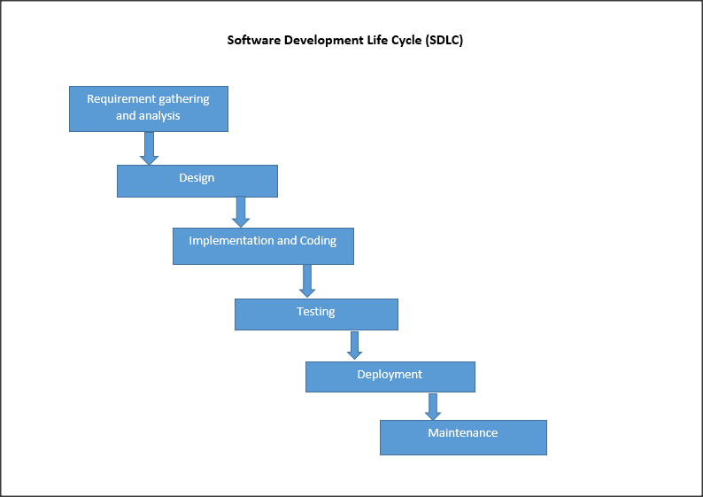

# what is SDLC ?
  1. SDLC stands for software development life cycle 
  2. SDLC is used to how to develop software within time and budget
  3. SDLC is a life cycle to develop a software 
  4. SDLC is a model of software engineering to develop software 

# phase in SDLC 

  1. to develop software follow a sdlc phase

     a) user requirement 
     b) SRS(software requirements specification) or analysis
     c) designing 
     d) implementation(coding)
     e) testing 
     f) maintainance

# architectures of SDLC 

  
