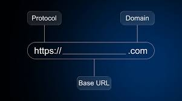

# what is URL list out all types of URL ?

  1) URL stands uniform resource locator 
  2) URL is open our website landing page and webpages 
  3) URL denoted by https://www.princynailarts.com


# types of URL ?

  1) absolute URL
     **examples**

     ```
     https://www.princynailarts.com
     ```
     
  2) relative URL

     **examples**
     ```
     https://www.princynailarts.com/aboutus
     or
     https://www.princynailarts.com/contactus

     
     ```

  **architetcures of URL**


     